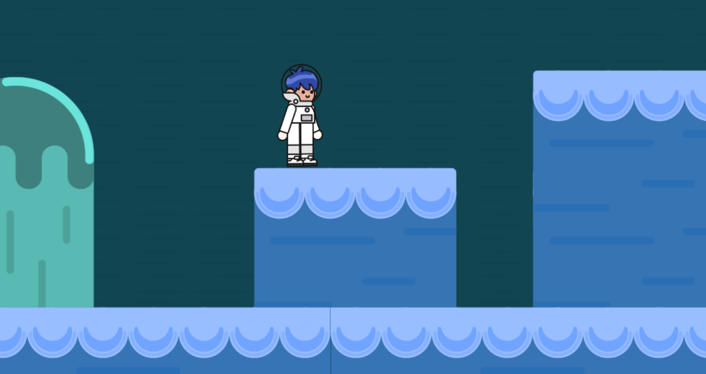

# DeltaHacks-Dino-Run-GAME


This Project was started for DeltaHacks 9 and it is a 2D Scroll Game starring a Dinosaur! 


# DeltaHacks-Space-Run-GAME
This Project was started for DeltaHacks 9 and it is a 2D Scroll Game starring an Astronaut! 

TLDR: Using Javascript and HTML to display and create a fun web game similar to classic games like Mario and Donkey Kong.

<h2>Background</h2>

This project was made during DeltaHacks 9 2023 to serve as a start to creating a web-based 2D scroll game. The premise being that a user/tester wears a set of eyetracking glasses to track what they look at. This data is then used to construct a heatmap of where users spend the most time looking on a web page. Compared to alternative methods of data collection, this approach allows developers to get data on user behaviour by tracking how they do things, rather than just what they do. This new analysis method is referred to by industry as behavioural analytics and is growing rapidly. Usually, people look before moving their cursor and this can't be tracked by traditional website analysis techniques such as clicks, DAU (engagement), and cursor movement. 




<h2>How It Works</h2>

Using Adhawk MindLinks to track eye position of user when on the website to create a heat map of what they are looking at. This data can be analyzed later to determine what users are focusing on, allowing developers to make improvements based on it. 

<h2>System Requirements</h2>

To recreate this project you will need the following hardware:
- Adhawk Mindlink Eye Tracking Glasses
- A Windows or Linux computer with USB-A or USB-C connectivity
- Cable to link/tether the glasses to the computer


To recreate this project you will need the following software:
- Adhawk Backend
- Adhawk Python SDK
- Python 3.8 or newer
- Pip (package manager)


<h2>Alternative Options (... And Why Our Method Is Better)</h2>

| Analytics Option | Description | Differences |
| --- | --- | --- |
| EYEs.py | - Tracks user behaviour at the core by tracking a physical component (their eyes) | - Tracks how the user interacts with their computer by directly tracking the eyes which are directed at what the user focuses on |
| MSFT Clarity | - Tracks user clicks, frequency of clicks, mouse position over time, etc | - Tracks user input through a layer of hardware so there's some data lost inherently |
| Google Analytics | - Session duration, bounce rate, engagement, traffic, etc | - Doesn't track how the user utilizes the UI so pain points and confusing areas in the UI are harder to catch |

<h2>Steps to Replicate</h2>

1. Clone the repository
	```sh git clone git@github.com:shaansuthar/Eye-Tracking-Heatmap.git```
2. Install the Adhawk Back End (attach the link here)
3. Install all dependencies using ```pip install *insert_dependencies_here*```
4. Run screen_tracking.py
	```sh python screen_tracking.py```


<h2>Next Steps</h2>

There are many things that we can do to improve on this project for the future, including:
- Create a recording tool to display the order in which each part of the website was viewed (i.e. the user first viewed the top left part of the page)
- Implementing a web-based front end with an API communication layer with Python backend
- Adapting our heat maps to adjust with scrolling and changing routes in a website
- Creating a dashboard for managing different user recordings and grouping the data
- Rescaling to prevent the tracking markers from covering content
- Combine insights with Microsoft Clarity and Google Analytics to get even more data on website performance for a wider variety of scenarios
- Train an AI/machine learning model to suggest changes by noticing pain points in the UI


<h2>Things I Used</h2>


Created by: [Nicholas Koenig](https://www.linkedin.com/in/nicholas-e-koenig/)